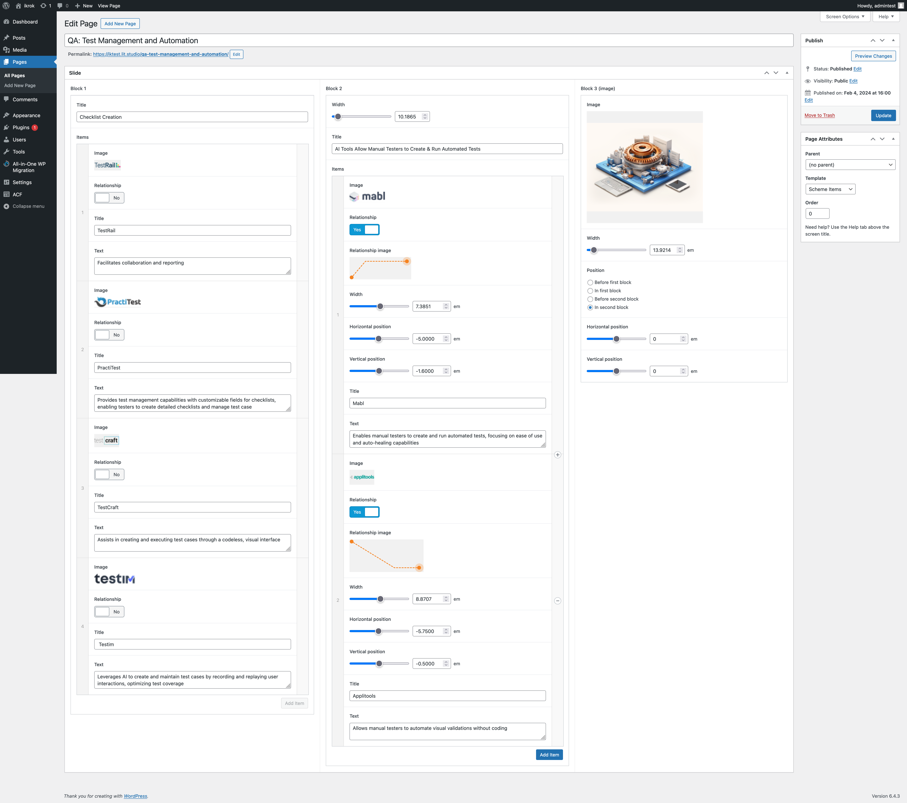

# iKrok slides
## Deploying a Website using All-in-One WP Migration

### Instructions:

1. Clone the site from Git.
2. Unzip the archive file `dump.zip` (In the root folder of the website.).
3. Upload the file with the `.wpress` extension using the All-in-One WP Migration plugin.
4. Update the permalinks.

## Deploying a Website using docker (I make no guarantee that it will work. For local deployment only!)

### Requirements:

1. Docker.
2. Docker Compose.

### Instructions:

1. Clone the site from Git.
2. Run `docker-compose up -d`.
3. Open the local link in the browser: http://localhost:8080/.

## Access to the WordPress admin panel.
Login: `admintest`
Password: `wZ6}4;u4yf%Vmt9`

## Links

### Dev link

https://iktest.lit.studio/

### Page links

https://iktest.lit.studio/qa-test-management-and-automation/

https://iktest.lit.studio/development-enhancing-code-quality/

## Screenshot

